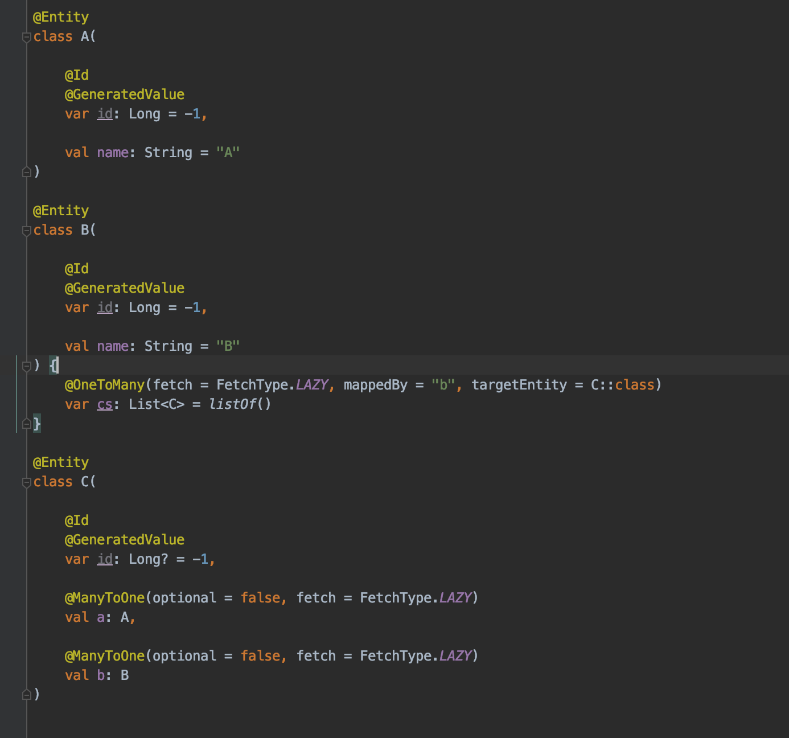
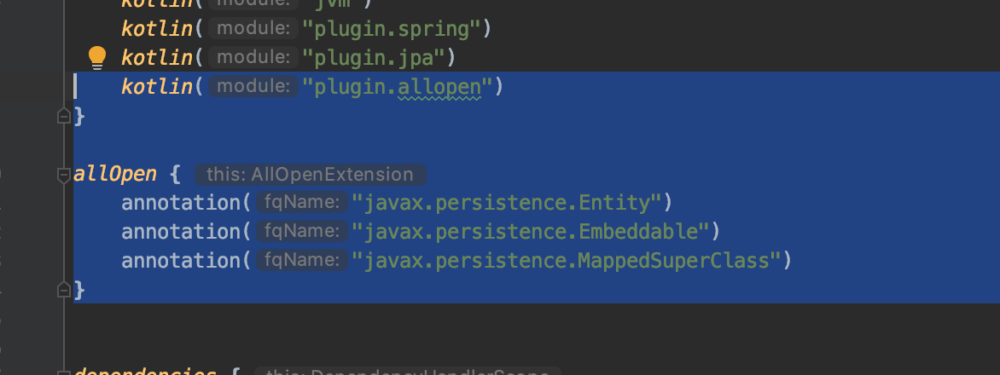
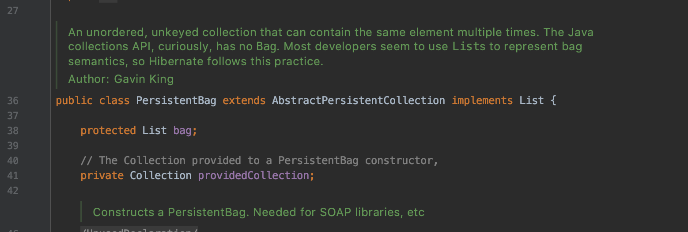

# Kotlin & Hibernate & Lazy Loading

## Entity 선언

간단하다. 이 상태에서, `C`에서 `A`, `B`를 Lazy Loading 한다.

테스트는 아래와 같다.

# Expected
기대대로라면,
1. c를 가져올때는 c 단독으로
2. c의 a에 접근할 떄 쿼리 한번
3. c의 b에 접근할 때 쿼리 한번 날려야 한다.

 
`cRepository`에서 `c` 가져올때 한꺼번에 다 가져온다... 이럴꺼면 조인해서 가져오던가

# 이유!
kotlin은 모든 클래스는 `final`이다.  
그렇다 보니 hibernate가 proxy 땜빵 객체를 못 만들어 주는 거다.

Entity 클래스들 디컴파일 해보면, 전부 `final`이다.

# All Open Plugin

## 우리의 구원자
얘를 적용하고 나면

open class가 된다!

그럼 테스트 결과는

짜잔 😎

# One To Many
OneToMany의 예제에서는, 항상 Lazy Loading이 동작한다. 나는 테스트로 `List`로 선언했는데, 
List는 오픈클래스이다.(자바 기준)

하이버네이트는 이 경우 `PersistetBag` 이라고 하는 특수한 프록시 객체이면서도, `List`를 상속하는 객체로 갈아끼운다.
그러니 Lazy Loading이 잘 동작함.

